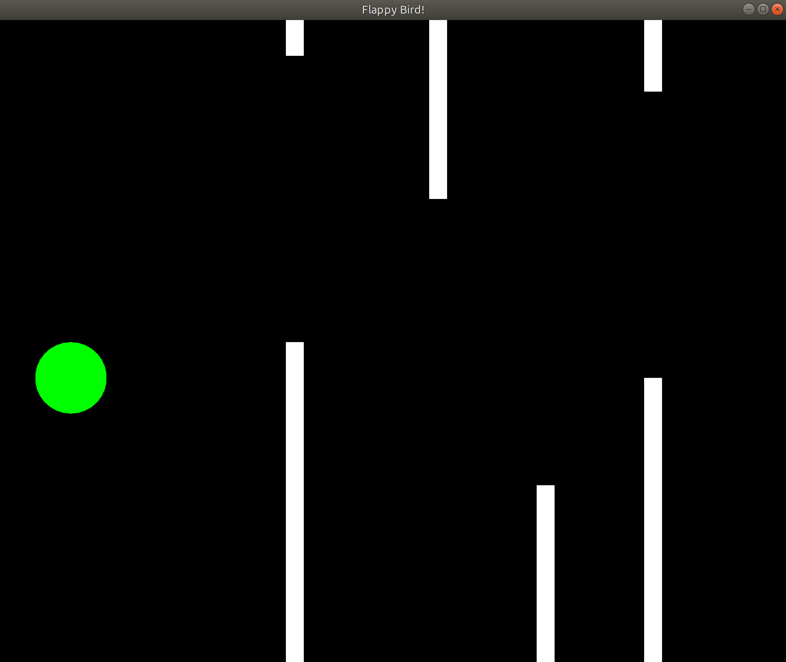

# Flappy Bird

Clone of the flappy bird game, written in C++ with SFML for graphics.

Built on Ubuntu 18.04.

Note that this game relies on SFML for graphics. SFML can be installed on Ubuntu with the package manager using the following command: 
`sudo apt-get install libsfml-dev`

To run the game, simple run the executable `./run.sh`

